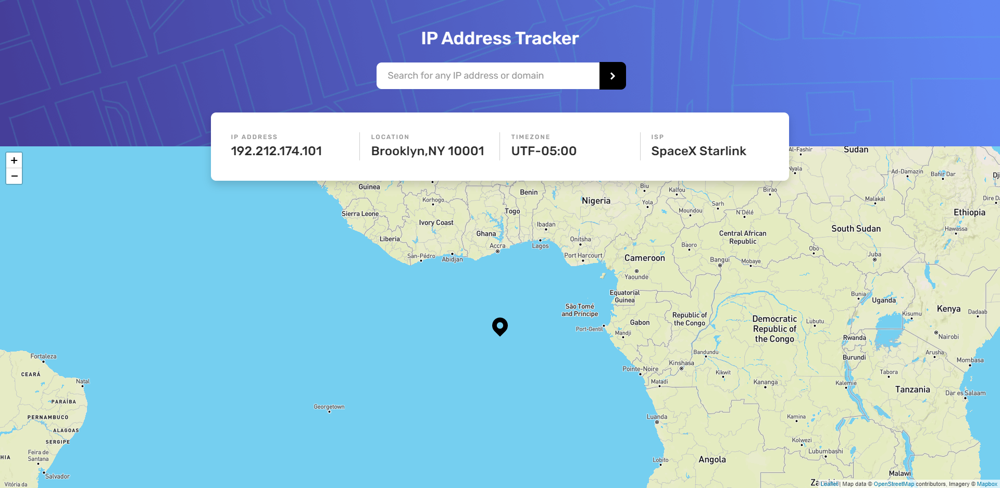
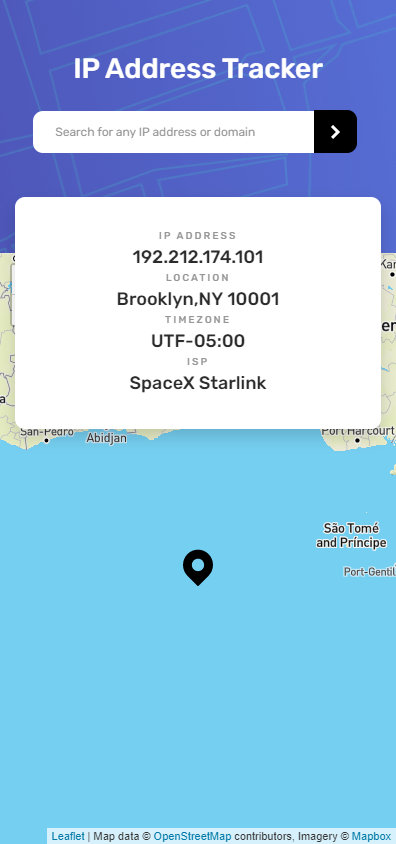

# Frontend Mentor - IP address tracker solution

This is a solution to the [IP address tracker challenge on Frontend Mentor](https://www.frontendmentor.io/challenges/ip-address-tracker-I8-0yYAH0). Frontend Mentor challenges help you improve your coding skills by building realistic projects.

## Table of contents

- [Overview](#overview)
  - [The challenge](#the-challenge)
  - [Screenshot](#screenshot)
  - [Links](#links)
- [My process](#my-process)
  - [Built with](#built-with)
  - [What I learned](#what-i-learned)
  - [Continued development](#continued-development)
- [Author](#author)

## Overview

### The challenge

Users should be able to:

- View the optimal layout for each page depending on their device's screen size
- See hover states for all interactive elements on the page
- See their own IP address on the map on the initial page load
- Search for any IP addresses or domains and see the key information and location

### Screenshot

#### Desktop

#### Mobile

### Links

- Solution URL: [Github](https://your-solution-url.com)
- Live Site URL: [Netlify](https://your-live-site-url.com)

## My process

### Built with

- Semantic HTML5 markup
- CSS custom properties
- Flexbox
- Mobile-first workflow
- Javascript

### What I learned

I learned how to use leafletjs and geoipfy api to make map and I also learned about how to display data on the page.

### Continued development

I will continue the development I want to show the ip address of the user on page load that's the only thing which is left.

## Author

- Website - [Faraz Mobin](https://github.com/Faraz-mobin17/)
- Frontend Mentor - [@Faraz-mobin17](https://www.frontendmentor.io/profile/Faraz-mobin17)
- Twitter - [@Faraz_mobin](https://twitter.com/Faraz_mobin)
